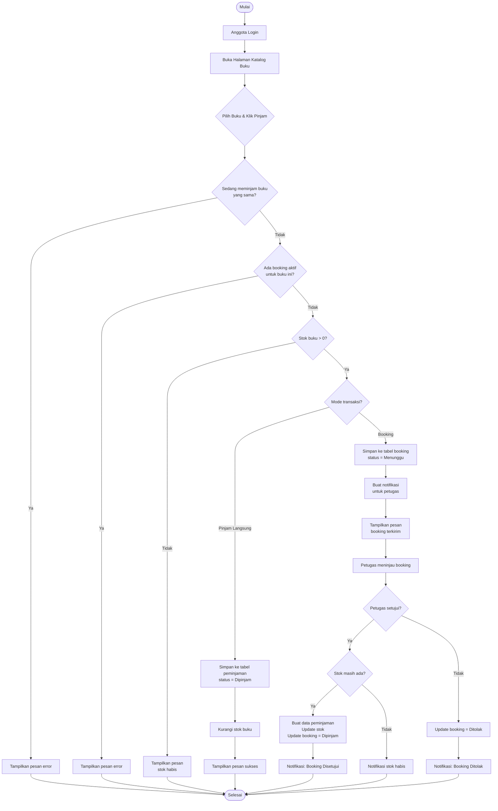
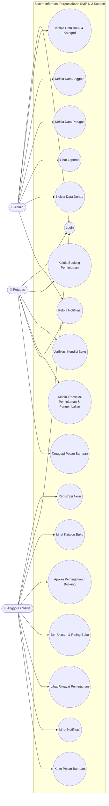
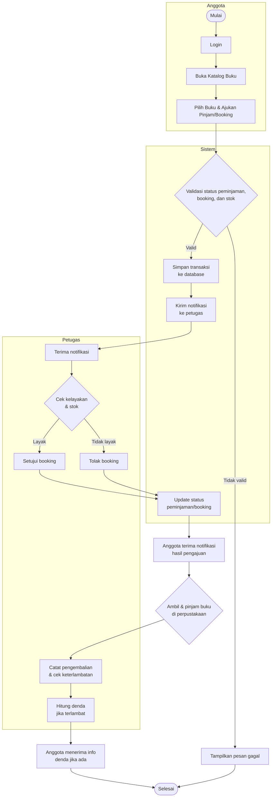
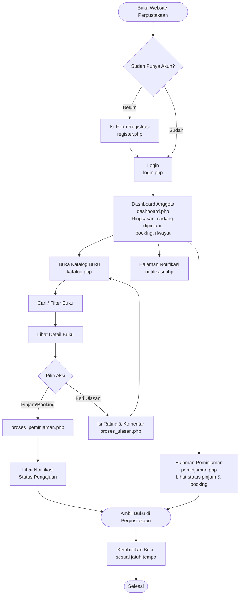

# Desain Sistem Informasi Perpustakaan SMP N 2 Sanden

Dokumen ini disusun berdasarkan analisis source code (folder `admin/`, `petugas/`, `anggota/`, `config/koneksi.php`, dll) dari project **ukkbaru.zip**. Sistem memiliki 3 aktor: **Admin**, **Petugas**, dan **Anggota (siswa)**, dengan fitur utama: manajemen data buku & anggota, peminjaman, booking, pengembalian & denda, notifikasi, dan ulasan buku.

---

## 1. Algoritma Sistem

### 1.1 Algoritma Login
```
MULAI
1. User membuka halaman login.php
2. INPUT username, password, role (admin/petugas/anggota)
3. JIKA role = "admin" MAKA
     Cari data di tabel admin WHERE username = input
4. JIKA role = "petugas" MAKA
     Cari data di tabel petugas WHERE username = input
5. JIKA role = "anggota" MAKA
     Cari data di tabel anggota WHERE nis = input ATAU nama_lengkap = input
6. JIKA data ditemukan DAN password cocok MAKA
     Simpan session sesuai role
     Alihkan ke dashboard (admin/petugas/anggota)
   SEBALIKNYA
     Tampilkan pesan "Login gagal"
SELESAI
```

### 1.2 Algoritma Peminjaman / Booking Buku (Anggota)
```
MULAI
1. Anggota login dan membuka katalog.php
2. Anggota memilih buku, klik "Pinjam"
3. Sistem cek: apakah anggota sudah meminjam buku yang sama & belum kembali?
   JIKA YA -> tolak, tampilkan pesan error
4. Sistem cek: apakah anggota sudah booking buku ini & masih "Menunggu"?
   JIKA YA -> tolak, tampilkan pesan error
5. Sistem cek stok buku
   JIKA stok <= 0 MAKA
        tampilkan pesan "Stok buku habis"
        SELESAI
6. JIKA proses = "pinjam langsung" MAKA
     a. INSERT ke tabel peminjaman (status='Dipinjam', kondisi_buku='Baik', denda_per_hari=1000,
        tgl_pinjam=hari ini, tgl_hrs_kembali=hari ini+7)
     b. UPDATE stok buku (stok = stok - 1)
   SEBALIKNYA (proses = "booking")
     a. Buat kode_booking unik
     b. INSERT ke tabel booking (status='Menunggu', batas_ambil=+2 hari,
        tanggal_jatuh_tempo perkiraan=+9 hari)
     c. INSERT notifikasi baru untuk petugas ("Booking Baru Masuk")
7. Tampilkan pesan sukses ke anggota
SELESAI
```

### 1.3 Algoritma Persetujuan Booking (Petugas)
```
MULAI
1. Petugas login, membuka booking.php / kelola_booking.php
2. Sistem tampilkan daftar booking WHERE status='Menunggu'
3. Petugas memilih satu booking, lalu:
   JIKA aksi = "Setujui" MAKA
        a. Cek ulang stok buku
        b. JIKA stok tersedia:
             - INSERT ke tabel peminjaman (status='Dipinjam')
             - UPDATE stok buku (stok - 1)
             - UPDATE booking SET status='Dipinjam'
             - INSERT notifikasi "Booking Disetujui"
           SEBALIKNYA:
             - tampilkan pesan stok habis
   JIKA aksi = "Tolak" MAKA
        a. UPDATE booking SET status='Ditolak'
        b. INSERT notifikasi "Booking Ditolak"
SELESAI
```

### 1.4 Algoritma Pengembalian Buku & Denda (Petugas)
```
MULAI
1. Petugas membuka transaksi.php, pilih data peminjaman aktif
2. Klik tombol "Kembalikan"
3. UPDATE peminjaman SET status='Dikembalikan', tanggal_dikembalikan = hari ini
4. JIKA tanggal_dikembalikan > tgl_hrs_kembali MAKA
     hitung selisih hari terlambat
     total_denda = selisih_hari * denda_per_hari
     UPDATE peminjaman SET total_denda, status_denda='Belum Lunas'
5. UPDATE stok buku (stok = stok + 1) [pengembalian fisik]
6. INSERT notifikasi pengembalian
7. Admin dapat memproses pembayaran denda melalui proses_bayar_denda.php
   -> UPDATE peminjaman SET status_denda='Lunas'
SELESAI
```

### 1.5 Algoritma Ulasan Buku (Anggota)
```
MULAI
1. Anggota memilih buku pada katalog, isi rating (1-5) dan komentar
2. Sistem cek apakah anggota sudah pernah mengulas buku ini
   JIKA SUDAH -> UPDATE data ulasan (rating & teks) 
   JIKA BELUM -> INSERT data ulasan baru (id_anggota, id_buku, rating, ulasan, tanggal)
3. Tampilkan pesan sukses, ulasan tampil di halaman utama (index.php)
SELESAI
```

---

## 2. Entity Relationship Diagram (ERD)

```mermaid
erDiagram
    KATEGORI ||--o{ BUKU : "memiliki"
    BUKU ||--o{ PEMINJAMAN : "dipinjam pada"
    ANGGOTA ||--o{ PEMINJAMAN : "melakukan"
    BUKU ||--o{ BOOKING : "dibooking pada"
    ANGGOTA ||--o{ BOOKING : "mengajukan"
    BUKU ||--o{ ULASAN : "diberi"
    ANGGOTA ||--o{ ULASAN : "menulis"
    PETUGAS ||--o{ PESAN_BANTUAN : "menindaklanjuti"

    ADMIN {
        int id_admin PK
        string username
        string password
    }

    PETUGAS {
        int id_petugas PK
        string nama_petugas
        string username
        string email
        string no_hp
        string password
    }

    ANGGOTA {
        int id_anggota PK
        string kode_anggota
        string nis
        string nama_lengkap
        string password
        string jk
        string tempat_lahir
        date tanggal_lahir
        string kelas
        string jurusan
        string alamat
        string status
    }

    KATEGORI {
        int id_kategori PK
        string nama_kategori
    }

    BUKU {
        int id_buku PK
        string id_cover
        string kode_buku
        string isbn
        string judul_buku
        int id_kategori FK
        string pengarang
        string penerbit
        string tahun_terbit
        string rak
        string lokasi_rak
        int stok
        string kondisi
        string catatan
    }

    PEMINJAMAN {
        int id_peminjaman PK
        int id_anggota FK
        int id_buku FK
        date tgl_pinjam
        date tgl_hrs_kembali
        date tanggal_dikembalikan
        string status
        string kondisi_buku
        int denda_per_hari
        string status_denda
        int total_denda
    }

    BOOKING {
        int id_booking PK
        string kode_booking
        int id_anggota FK
        string nama_anggota
        int id_buku FK
        string kode_buku
        string judul_buku
        datetime tanggal_booking
        date batas_ambil
        date tanggal_jatuh_tempo
        string status
    }

    ULASAN {
        int id_ulasan PK
        int id_anggota FK
        int id_buku FK
        int rating
        string ulasan
        date tanggal
    }

    NOTIFIKASI {
        int id_notif PK
        string judul
        string pesan
        string tipe
        string status
        datetime created_at
    }

    PESAN_BANTUAN {
        int id_pesan PK
        string nama
        string email
        string pesan
        date tanggal
        string status
        int id_petugas FK
    }
```



---

## 3. Flowchart Sistem (Alur Peminjaman & Booking Buku)



---

## 4. Use Case Diagram



---

## 5. Activity Diagram (Proses Peminjaman Buku hingga Pengembalian)



---

## 6. User Flow (Sisi Anggota / Siswa)



---

### Catatan
- Diagram di atas dibuat berdasarkan struktur tabel & alur logika yang benar-benar ada di kode (`config/koneksi.php`, `admin/*.php`, `petugas/*.php`, `anggota/*.php`).
- Tabel `admin` tidak memiliki fitur tambah/edit di kode (hanya dipakai untuk login), sehingga di ERD hanya field dasarnya yang disertakan.
- File ini bisa dibuka di editor yang mendukung **Mermaid** (mis. Markdown preview di VS Code, Typora, atau Mermaid Live Editor di mermaid.live) untuk melihat diagram secara visual, atau di-convert ke gambar/PDF bila diperlukan untuk laporan UKK.
