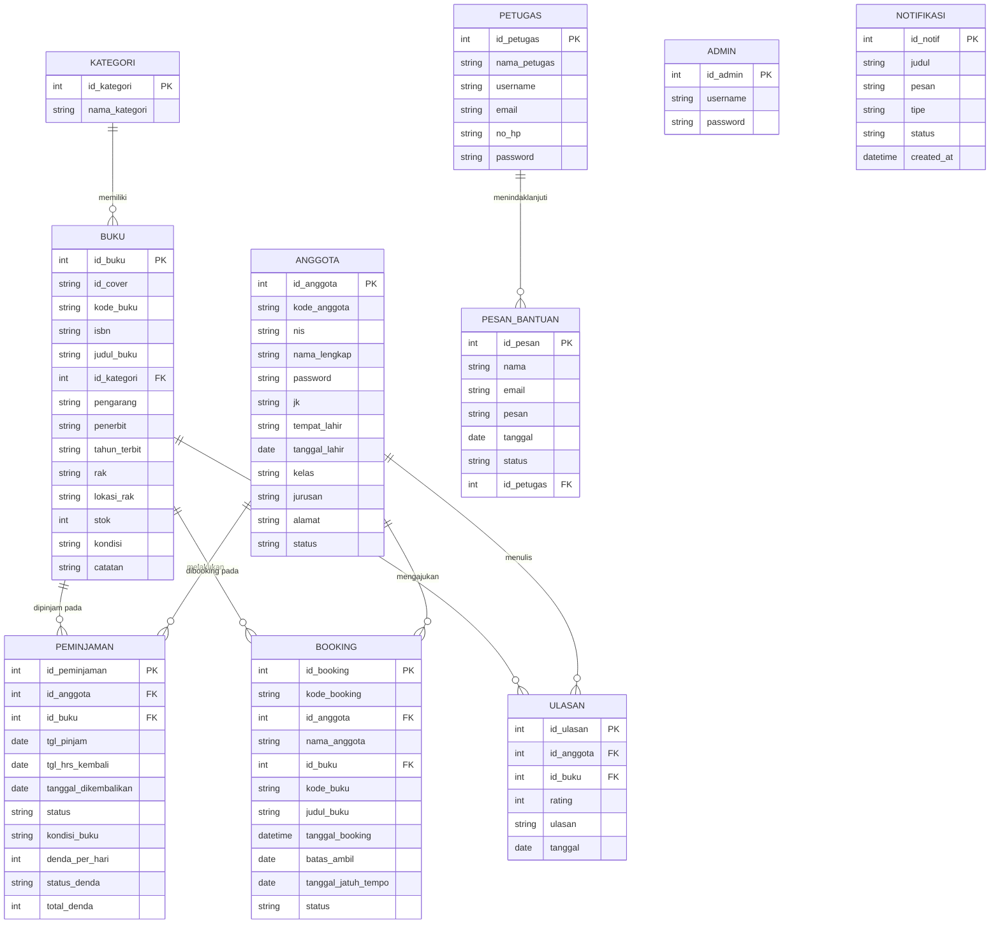
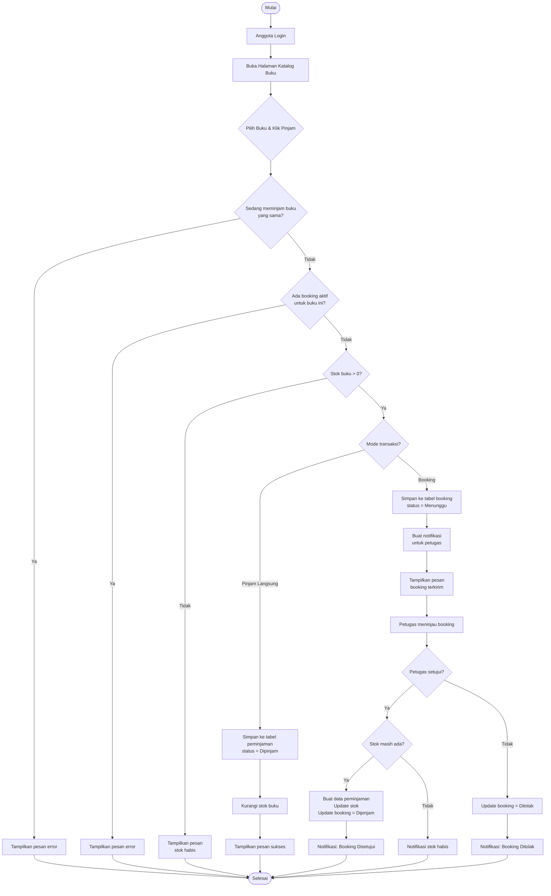
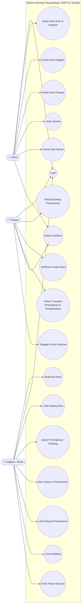
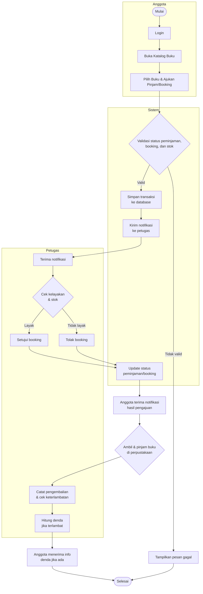
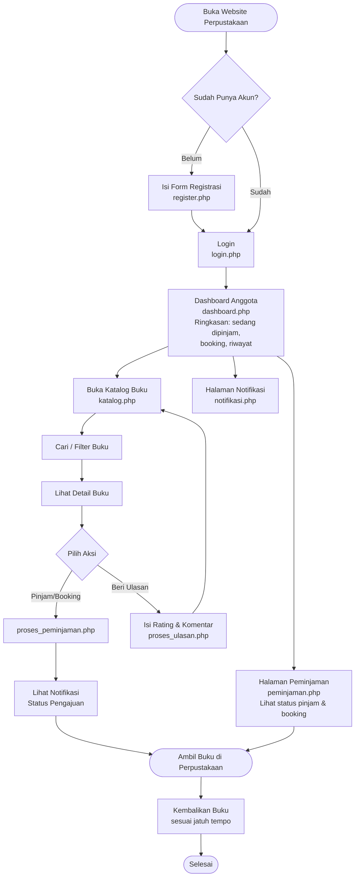

# Desain Sistem Informasi Perpustakaan SMP N 2 Sanden
# 📚 Sistem Informasi Perpustakaan Digital SMP N 2 Sanden

<p align="center">
  
  
  
  
  
  
</p>

<p align="center">
  <b>📖 Sistem Informasi Perpustakaan Digital</b><br>
  <i>SMP Negeri 2 Sanden </i>
   <i>Oleh NITA</i>
</p>

---

WIREFRAME: https://raw.githubusercontent.com/Nitaeka11/ukkperpus/refs/heads/main/WIREFRAME.png

## 📌 Tentang Project

**Sistem Informasi Perpustakaan Digital SMP N 2 Sanden** merupakan aplikasi berbasis web yang dibuat untuk membantu proses pengelolaan perpustakaan sekolah secara lebih mudah, cepat, terstruktur, dan terdigitalisasi.

Aplikasi ini dirancang untuk menggantikan proses pengelolaan perpustakaan yang sebelumnya dilakukan secara manual menjadi sistem berbasis komputer yang dapat digunakan oleh petugas/admin maupun siswa.

Sistem menyediakan berbagai fitur utama seperti:

* 🏠 Landing Page
* 🔐 Login
* 👨‍💼 Dashboard Admin/Petugas
* 👨‍🎓 Dashboard Siswa
* 📚 Data Buku
* 🏷️ Kategori Buku
* 👥 Data Anggota
* 📖 Peminjaman Buku
* 🔄 Pengembalian Buku
* 📊 Laporan Perpustakaan
* 🔎 Pencarian Buku
* 📈 Statistik Perpustakaan
* 📝 Pengelolaan Data Transaksi
* 🗃️ Database MySQL
* 📱 Tampilan responsive

Project ini dikembangkan menggunakan **PHP dan MySQL** serta dijalankan menggunakan web server seperti **XAMPP**.

---

# 🎯 Tujuan Project

Tujuan utama pembuatan aplikasi ini adalah:

1. Membantu petugas perpustakaan dalam mengelola data buku.
2. Mempermudah pengelolaan data anggota.
3. Mempermudah proses peminjaman buku.
4. Mempermudah proses pengembalian buku.
5. Mengurangi pencatatan manual.
6. Meminimalkan kesalahan dalam pencatatan transaksi.
7. Mempermudah pencarian data buku.
8. Menyediakan laporan perpustakaan secara terstruktur.
9. Membantu siswa mencari dan melihat koleksi buku.
10. Meningkatkan efisiensi pelayanan perpustakaan sekolah.

---

# 🏫 Informasi Project

| Informasi          | Detail                                |
| ------------------ | ------------------------------------- |
| Nama Sistem        | Sistem Informasi Perpustakaan Digital |
| Sekolah            | SMP Negeri 2 Sanden                   |
| Jenis Project      | Website Sistem Informasi              |
| Platform           | Web                                   |
| Bahasa Pemrograman | PHP                                   |
| Database           | MySQL                                 |
| Frontend           | HTML, CSS, JavaScript                 |
| Framework UI       | Bootstrap                             |
| Web Server         | Apache                                |
| Local Server       | XAMPP                                 |
| Database Name      | `ukk_perpus`                          |
| Target Pengguna    | Admin/Petugas dan Siswa               |

---

# ✨ Fitur Utama

## 🏠 1. Landing Page

Landing page merupakan halaman awal website yang menjadi pintu masuk pengguna ke dalam sistem.

Pada halaman ini pengguna dapat melihat:

* Identitas perpustakaan
* Informasi perpustakaan
* Deskripsi sistem
* Navigasi website
* Tombol masuk/login
* Informasi layanan perpustakaan
* Tampilan visual perpustakaan

Landing page dibuat agar pengguna mendapatkan gambaran mengenai sistem sebelum masuk ke halaman utama.

---

# 🔐 2. Sistem Login

Sistem menyediakan halaman login untuk membatasi akses ke dalam sistem.

Login digunakan untuk memastikan bahwa hanya pengguna yang memiliki akun yang dapat mengakses fitur tertentu.

Fitur login meliputi:

* Username/email
* Password
* Validasi input
* Session
* Logout
* Proteksi halaman
* Redirect setelah login

### Alur Login

```text
Landing Page
     │
     ▼
   Login
     │
     ▼
Validasi Akun
     │
 ┌───┴────┐
 │        │
Gagal   Berhasil
 │        │
 ▼        ▼
Login    Dashboard
lagi
```

---

# 👨‍💼 3. Dashboard Admin/Petugas

Dashboard admin/petugas merupakan pusat pengelolaan sistem perpustakaan.

Dashboard menampilkan informasi penting secara ringkas sehingga petugas dapat mengetahui kondisi perpustakaan dengan cepat.

### Informasi Dashboard

Contohnya:

* 📚 Total Buku
* 👥 Total Anggota
* 📖 Total Peminjaman
* 🔄 Total Pengembalian
* ⚠️ Peminjaman Terlambat
* 📊 Statistik Peminjaman
* 📈 Grafik transaksi
* 🕐 Aktivitas terbaru

Dashboard dirancang dengan tampilan modern, bersih, dan mudah digunakan.

---

# 📚 4. Manajemen Data Buku

Fitur buku digunakan untuk mengelola seluruh koleksi buku perpustakaan.

Admin/petugas dapat:

* Menambahkan buku
* Melihat buku
* Mengedit buku
* Menghapus buku
* Mencari buku
* Melihat detail buku
* Mengelompokkan buku berdasarkan kategori
* Mengatur jumlah/stok buku

### Informasi Buku

Data buku dapat terdiri dari:

* ID Buku
* Kode Buku
* ISBN
* Judul Buku
* Penulis
* Penerbit
* Tahun Terbit
* Kategori
* Jumlah/Stok
* Lokasi/Rak
* Deskripsi
* Cover buku

---

# 🏷️ 5. Kategori Buku

Kategori digunakan untuk mengelompokkan koleksi buku berdasarkan jenisnya.

Contoh kategori:

* 📖 Fiksi
* 🔬 Sains
* 📚 Pendidikan
* 🕌 Agama
* 💻 Teknologi
* 🧮 Matematika
* 🌎 IPS
* 🔤 Bahasa
* 🎨 Seni
* 📕 Novel
* 📗 Referensi

Admin dapat:

* Menambah kategori
* Mengubah kategori
* Menghapus kategori
* Melihat jumlah buku dalam kategori

---

# 👥 6. Manajemen Anggota

Fitur anggota digunakan untuk mengelola data siswa yang terdaftar sebagai anggota perpustakaan.

Data anggota dapat meliputi:

* ID Anggota
* NIS
* Nama
* Kelas
* Jenis Kelamin
* Alamat
* Nomor Telepon
* Email
* Tanggal Daftar
* Status Anggota

Admin dapat melakukan:

* ➕ Tambah anggota
* 👁️ Lihat anggota
* ✏️ Edit anggota
* 🗑️ Hapus anggota
* 🔎 Cari anggota

---

# 📖 7. Peminjaman Buku

Fitur peminjaman digunakan untuk mencatat transaksi ketika anggota meminjam buku.

### Proses Peminjaman

```text
Pilih Anggota
      │
      ▼
Pilih Buku
      │
      ▼
Cek Ketersediaan
      │
      ▼
Tentukan Tanggal
      │
      ▼
Simpan Transaksi
      │
      ▼
Stok Buku Berkurang
      │
      ▼
Transaksi Berhasil
```

Data peminjaman dapat meliputi:

* ID Peminjaman
* ID Anggota
* Nama Anggota
* ID Buku
* Judul Buku
* Tanggal Peminjaman
* Tanggal Jatuh Tempo
* Status Peminjaman
* Petugas

---

# 🔄 8. Pengembalian Buku

Fitur pengembalian digunakan untuk mencatat buku yang telah dikembalikan oleh siswa.

Ketika buku dikembalikan, sistem dapat memperbarui:

* Status peminjaman
* Tanggal pengembalian
* Stok buku
* Status keterlambatan
* Denda apabila diperlukan

### Alur Pengembalian

```text
Cari Transaksi
      │
      ▼
Pilih Peminjaman
      │
      ▼
Klik Pengembalian
      │
      ▼
Cek Tanggal
      │
 ┌────┴─────┐
 │          │
Tepat    Terlambat
 │          │
 ▼          ▼
Tanpa      Hitung
Denda      Denda
 │          │
 └────┬─────┘
      ▼
Simpan Pengembalian
      │
      ▼
Stok Buku Bertambah
```

---

# 📊 9. Laporan Perpustakaan

Laporan digunakan untuk memberikan informasi lengkap mengenai aktivitas perpustakaan.

Laporan dapat digunakan oleh admin/petugas untuk melihat dan menyampaikan kondisi perpustakaan kepada pihak sekolah atau kepala sekolah.

### Laporan dapat mencakup:

* Total buku
* Total anggota
* Total peminjaman
* Total pengembalian
* Peminjaman aktif
* Buku terlambat
* Data anggota
* Data buku
* Data transaksi
* Riwayat peminjaman
* Riwayat pengembalian
* Data denda
* Statistik transaksi

### Contoh Ringkasan

```text
========================================
       LAPORAN PERPUSTAKAAN
        SMP N 2 SANDEN
========================================

Total Buku             : xxx
Total Anggota          : xxx
Total Peminjaman       : xxx
Total Pengembalian     : xxx
Peminjaman Aktif       : xxx
Keterlambatan          : xxx
========================================
```

Laporan dibuat agar data perpustakaan dapat dipantau dengan lebih mudah dan terstruktur.

---

# 🔎 10. Pencarian Buku

Sistem menyediakan fitur pencarian untuk membantu pengguna menemukan buku dengan cepat.

Pencarian dapat dilakukan berdasarkan:

* Judul buku
* Penulis
* Penerbit
* ISBN
* Kategori
* Kode buku

Contoh:

```text
Cari buku...
[________________________________]
             🔍
```

---

# 👨‍🎓 11. Dashboard Siswa

Dashboard siswa dibuat khusus untuk pengguna siswa.

Siswa dapat melihat informasi perpustakaan tanpa harus mengakses fitur administrasi.

Fitur siswa dapat meliputi:

* 📚 Koleksi Buku
* 🔎 Cari Buku
* 📖 Detail Buku
* 📋 Riwayat Peminjaman
* 🔄 Status Pengembalian
* 👤 Profil
* 🚪 Logout

---

# 📱 Responsive Design

Website dirancang agar dapat digunakan pada berbagai ukuran perangkat:

* 💻 Desktop
* 🖥️ Laptop
* 📱 Smartphone
* 📟 Tablet

Tampilan menyesuaikan ukuran layar sehingga pengguna tetap dapat mengakses sistem dengan nyaman.

---

# 🎨 Konsep UI/UX

Sistem menggunakan konsep desain yang:

* Modern
* Clean
* Simple
* User Friendly
* Responsive
* Mudah dipahami
* Konsisten
* Cocok untuk lingkungan sekolah

Warna utama menggunakan nuansa **biru laut/blue** yang memberikan kesan:

* 📘 Pendidikan
* 🌊 Tenang
* 💙 Profesional
* 🏫 Formal tetapi tetap menarik

---

# 🛠️ Teknologi yang Digunakan

## Backend

### PHP

PHP digunakan sebagai bahasa pemrograman utama untuk membangun sistem backend.

Digunakan untuk:

* Login
* Session
* CRUD
* Query database
* Validasi
* Transaksi peminjaman
* Pengembalian
* Laporan

---

## Database

### MySQL

MySQL digunakan sebagai sistem database untuk menyimpan seluruh data perpustakaan.

Database:

```text
ukk_perpus
```

---

## Frontend

### HTML5

Digunakan untuk membangun struktur halaman website.

### CSS3

Digunakan untuk:

* Layout
* Warna
* Animasi
* Responsive design
* Komponen UI

### JavaScript

Digunakan untuk membuat halaman lebih interaktif.

### Bootstrap

Digunakan untuk membantu pembuatan:

* Navbar
* Card
* Modal
* Table
* Button
* Form
* Responsive layout

---

# 🗄️ Struktur Database

Database utama:

```text
ukk_perpus
```

Beberapa tabel utama yang digunakan dalam sistem antara lain:

```text
ukk_perpus
│
├── admin
│
├── anggota
│
├── buku
│
├── kategori
│
└── peminjaman
```

---

# 🔗 Relasi Database

Gambaran sederhana hubungan antar tabel:

```text
              ┌─────────────┐
              │   KATEGORI  │
              └──────┬──────┘
                     │
                     │
                     ▼
              ┌─────────────┐
              │     BUKU    │
              └──────┬──────┘
                     │
                     │
                     ▼
┌─────────────┐  ┌─────────────┐
│   ANGGOTA   │──│ PEMINJAMAN  │
└─────────────┘  └─────────────┘
                     │
                     ▼
               PENGEMBALIAN
```

---

# 📂 Struktur Folder Project

Contoh struktur project:

```text
perpustakaan/
│
├── index.php
├── login.php
├── logout.php
├── koneksi.php
│
├── dashboard.php
├── dashboard_siswa.php
│
├── buku/
│   ├── buku.php
│   ├── tambah.php
│   ├── edit.php
│   ├── hapus.php
│   └── detail.php
│
├── kategori/
│   ├── kategori.php
│   ├── tambah.php
│   ├── edit.php
│   └── hapus.php
│
├── anggota/
│   ├── anggota.php
│   ├── tambah.php
│   ├── edit.php
│   └── hapus.php
│
├── peminjaman/
│   ├── peminjaman.php
│   ├── tambah.php
│   ├── detail.php
│   └── hapus.php
│
├── pengembalian/
│   ├── pengembalian.php
│   └── proses.php
│
├── laporan/
│   └── laporan.php
│
├── assets/
│   ├── css/
│   ├── js/
│   ├── img/
│   └── icons/
│
└── database/
    └── ukk_perpus.sql
```

> Nama file dapat disesuaikan dengan struktur project sebenarnya.

---

# ⚙️ Instalasi

## 1. Clone Repository

```bash
git clone https://github.com/USERNAME/NAMA-REPOSITORY.git
```

Kemudian masuk ke folder:

```bash
cd NAMA-REPOSITORY
```

---

# 2. Install XAMPP

Download dan install XAMPP pada komputer.

Pastikan:

```text
Apache
MySQL
```

dapat dijalankan.

---

# 3. Letakkan Project

Pindahkan folder project ke:

```text
C:\xampp\htdocs\
```

Contoh:

```text
C:\xampp\htdocs\perpustakaan\
```

---

# 4. Jalankan XAMPP

Buka XAMPP Control Panel kemudian aktifkan:

```text
Apache → Start
MySQL  → Start
```

---

# 5. Membuat Database

Buka:

```text
http://localhost/phpmyadmin
```

Buat database:

```text
ukk_perpus
```

Kemudian import file:

```text
ukk_perpus.sql
```

---

# 6. Konfigurasi Database

Sesuaikan file:

```text
koneksi.php
```

Contoh konfigurasi:

```php
<?php

$host = "localhost";
$user = "root";
$pass = "";
$db   = "ukk_perpus";

$conn = mysqli_connect($host, $user, $pass, $db);

if (!$conn) {
    die("Koneksi database gagal: " . mysqli_connect_error());
}
?>
```

Sesuaikan konfigurasi dengan server yang digunakan.

---

# 7. Menjalankan Website

Buka browser:

```text
http://localhost/perpustakaan/
```

Jika project berada di folder lain, sesuaikan URL dengan nama folder project.

---

# 🌐 Versi Online

Project juga dapat digunakan secara online melalui hosting.

Website:

**Perpustakaan Digital SMP N 2 Sanden**

```text
https://perpusnita.free.nf/
```

> URL dapat berubah apabila hosting, domain, atau konfigurasi website diubah.

---

# 🔐 Keamanan Sistem

Beberapa aspek keamanan yang perlu diperhatikan:

* Menggunakan session untuk autentikasi.
* Validasi input pengguna.
* Validasi login.
* Proteksi halaman admin.
* Logout untuk menghapus session.
* Validasi data sebelum masuk database.
* Menghindari query database secara sembarangan.
* Menggunakan prepared statement untuk sistem yang lebih aman.
* Password sebaiknya disimpan menggunakan `password_hash()`.

Contoh:

```php
$password_hash = password_hash($password, PASSWORD_DEFAULT);
```

Untuk proses login:

```php
password_verify($password, $password_hash);
```

---

# 🔄 CRUD System

Sistem menggunakan konsep CRUD:

```text
C = Create
R = Read
U = Update
D = Delete
```

### Create

Menambahkan data baru.

### Read

Menampilkan data dari database.

### Update

Mengubah data.

### Delete

Menghapus data.

CRUD digunakan pada berbagai modul seperti:

* Buku
* Kategori
* Anggota
* Peminjaman
* Data admin

---

# 📚 Alur Sistem Perpustakaan

```text
                    START
                      │
                      ▼
                LANDING PAGE
                      │
                      ▼
                    LOGIN
                      │
               ┌──────┴──────┐
               │             │
               ▼             ▼
             ADMIN          SISWA
               │             │
               ▼             ▼
          DASHBOARD      DASHBOARD
               │             │
      ┌────────┼────────┐    │
      │        │        │    │
      ▼        ▼        ▼    ▼
     BUKU   ANGGOTA  LAPORAN KOLEKSI
      │        │        │    │
      └────────┼────────┘    │
               │             │
               ▼             ▼
          PEMINJAMAN     CARI BUKU
               │
               ▼
         PENGEMBALIAN
               │
               ▼
             SELESAI
```

---

# 📖 Alur Peminjaman

```text
Siswa memilih buku
        │
        ▼
Sistem mengecek stok
        │
   ┌────┴────┐
   │         │
 Tersedia  Habis
   │         │
   ▼         ▼
Pinjam    Tidak bisa
   │
   ▼
Simpan transaksi
   │
   ▼
Stok berkurang
   │
   ▼
Peminjaman aktif
```

---

# 🔄 Alur Pengembalian

```text
Buku dikembalikan
       │
       ▼
Cari transaksi
       │
       ▼
Cek tanggal kembali
       │
   ┌───┴────┐
   │        │
Tepat    Terlambat
   │        │
   ▼        ▼
Tanpa    Hitung
denda    denda
   │        │
   └───┬────┘
       ▼
Update transaksi
       │
       ▼
Tambah stok buku
       │
       ▼
Selesai
```

---

# 📊 Statistik Dashboard

Dashboard dapat menampilkan statistik seperti:

```text
┌─────────────────┐
│   TOTAL BUKU    │
│      1.250      │
└─────────────────┘

┌─────────────────┐
│ TOTAL ANGGOTA   │
│       350       │
└─────────────────┘

┌─────────────────┐
│ PEMINJAMAN      │
│       125       │
└─────────────────┘

┌─────────────────┐
│ PENGEMBALIAN    │
│       100       │
└─────────────────┘
```

Angka tersebut harus diambil secara dinamis dari database, bukan ditulis secara manual.

---

# 📈 Grafik Peminjaman

Dashboard dapat menggunakan grafik untuk menunjukkan perkembangan transaksi perpustakaan.

Contoh:

```text
Jumlah
  │
50│       █
40│   █   █
30│   █   █   █
20│ █ █   █   █
10│ █ █ █ █   █
  └────────────────
    Jan Feb Mar Apr
```

Grafik dapat digunakan untuk mengetahui:

* Jumlah peminjaman per bulan
* Jumlah pengembalian
* Buku paling sering dipinjam
* Aktivitas anggota

---

# 🧪 Testing

Sebelum sistem digunakan, lakukan pengujian terhadap fitur utama.

| Fitur        | Pengujian                |
| ------------ | ------------------------ |
| Login        | Username/password benar  |
| Login        | Username/password salah  |
| Buku         | Tambah buku              |
| Buku         | Edit buku                |
| Buku         | Hapus buku               |
| Buku         | Cari buku                |
| Anggota      | Tambah anggota           |
| Anggota      | Edit anggota             |
| Anggota      | Hapus anggota            |
| Peminjaman   | Tambah transaksi         |
| Peminjaman   | Cek stok                 |
| Pengembalian | Pengembalian tepat waktu |
| Pengembalian | Pengembalian terlambat   |
| Laporan      | Menampilkan data         |
| Logout       | Session terhapus         |

---

# 🐛 Troubleshooting

## Database tidak terkoneksi

Pastikan:

```text
MySQL = Running
```

Kemudian periksa:

```php
$host = "localhost";
$user = "root";
$pass = "";
$db   = "ukk_perpus";
```

---

## Website tidak dapat dibuka

Pastikan Apache aktif.

Kemudian buka:

```text
http://localhost/
```

Jika berhasil, coba:

```text
http://localhost/perpustakaan/
```

---

## Error Table Doesn't Exist

Pastikan database:

```text
ukk_perpus
```

sudah dibuat dan file SQL sudah di-import.

---

## Error Unknown Database

Pastikan nama database sama:

```text
ukk_perpus
```

---

# 🚀 Pengembangan Selanjutnya

Sistem masih dapat dikembangkan dengan berbagai fitur tambahan.

### Fitur yang dapat ditambahkan:

* 📱 Progressive Web App
* 📲 QR Code buku
* 🔍 Barcode scanner
* 📧 Notifikasi email
* 🔔 Notifikasi jatuh tempo
* 📊 Grafik lebih lengkap
* 🖨️ Cetak laporan
* 📄 Export PDF
* 📊 Export Excel
* 👤 Profil pengguna
* 🔑 Reset password
* 🖼️ Upload cover buku
* ⭐ Rating buku
* ❤️ Buku favorit
* 🔎 Pencarian lebih advanced
* 📚 Rekomendasi buku
* 📱 Tampilan mobile yang lebih optimal

---

# 🎓 Manfaat Bagi Sekolah

Dengan adanya sistem ini, perpustakaan sekolah dapat:

* Mengurangi penggunaan pencatatan manual.
* Mempercepat pelayanan siswa.
* Mempermudah pencarian buku.
* Mempermudah pengelolaan anggota.
* Mempermudah monitoring transaksi.
* Menghasilkan laporan dengan lebih cepat.
* Menyimpan data secara terstruktur.
* Meningkatkan efisiensi kerja petugas.
* Memberikan pengalaman digital kepada siswa.

---

# 👨‍💻 Developer

Project ini dikembangkan sebagai project pembelajaran dan pengembangan sistem informasi perpustakaan berbasis web.

### Project

**Sistem Informasi Perpustakaan Digital SMP N 2 Sanden**

### Teknologi

```text
PHP
MySQL
HTML5
CSS3
JavaScript
Bootstrap
XAMPP
```

---

# 📜 License

Project ini dibuat untuk tujuan pembelajaran dan pengembangan sistem informasi perpustakaan sekolah.

Penggunaan, pengembangan, dan modifikasi project dapat disesuaikan dengan kebutuhan sekolah.

---

# ❤️ Acknowledgement

Terima kasih kepada:

* SMP Negeri 2 Sanden
* Guru pembimbing
* Petugas perpustakaan
* Teman-teman yang membantu proses pengembangan
* Semua pihak yang memberikan dukungan dalam pembuatan sistem

---

# 📞 Contact

Untuk informasi lebih lanjut mengenai project, silakan menghubungi developer melalui repository GitHub atau kontak yang tersedia pada project.

---

# 🌐 Website

**Live Demo:**

https://perpusnita.free.nf/

---

# ⭐ Support Project

Jika project ini membantu atau bermanfaat, jangan lupa memberikan ⭐ pada repository GitHub.

```text
⭐ Star Repository
🍴 Fork Repository
🐛 Report Issue
💡 Suggest Feature
```

---

## 📌 Kesimpulan

**Sistem Informasi Perpustakaan Digital SMP N 2 Sanden** dibuat sebagai solusi digital untuk membantu pengelolaan perpustakaan sekolah.

Dengan sistem ini, proses pengelolaan:

```text
📚 Buku
👥 Anggota
📖 Peminjaman
🔄 Pengembalian
📊 Laporan
```

dapat dilakukan secara lebih terstruktur, cepat, dan efisien.

Project ini juga menjadi sarana pembelajaran dalam penerapan:

```text
PHP
↓
MySQL
↓
CRUD
↓
Session & Authentication
↓
Database Relationship
↓
UI/UX
↓
Sistem Informasi
```

**📚 Membaca lebih mudah. Mengelola lebih cepat. Perpustakaan lebih modern. 💙**

---

<p align="center">
  <b>📖 Sistem Informasi Perpustakaan Digital</b><br>
  <b>SMP Negeri 2 Sanden</b>
</p>

<p align="center">
  Made with 💙 using PHP & MySQL
</p>


Dokumen ini disusun berdasarkan analisis source code (folder `admin/`, `petugas/`, `anggota/`, `config/koneksi.php`, dll) dari project **ukkbaru.zip**. Sistem memiliki 3 aktor: **Admin**, **Petugas**, dan **Anggota (siswa)**, dengan fitur utama: manajemen data buku & anggota, peminjaman, booking, pengembalian & denda, notifikasi, dan ulasan buku.

---

## 1. Algoritma Sistem

### 1.1 Algoritma Login
```
MULAI
1. User membuka halaman login.php
2. INPUT username, password, role (admin/petugas/anggota)
3. JIKA role = "admin" MAKA
     Cari data di tabel admin WHERE username = input
4. JIKA role = "petugas" MAKA
     Cari data di tabel petugas WHERE username = input
5. JIKA role = "anggota" MAKA
     Cari data di tabel anggota WHERE nis = input ATAU nama_lengkap = input
6. JIKA data ditemukan DAN password cocok MAKA
     Simpan session sesuai role
     Alihkan ke dashboard (admin/petugas/anggota)
   SEBALIKNYA
     Tampilkan pesan "Login gagal"
SELESAI
```

### 1.2 Algoritma Peminjaman / Booking Buku (Anggota)
```
MULAI
1. Anggota login dan membuka katalog.php
2. Anggota memilih buku, klik "Pinjam"
3. Sistem cek: apakah anggota sudah meminjam buku yang sama & belum kembali?
   JIKA YA -> tolak, tampilkan pesan error
4. Sistem cek: apakah anggota sudah booking buku ini & masih "Menunggu"?
   JIKA YA -> tolak, tampilkan pesan error
5. Sistem cek stok buku
   JIKA stok <= 0 MAKA
        tampilkan pesan "Stok buku habis"
        SELESAI
6. JIKA proses = "pinjam langsung" MAKA
     a. INSERT ke tabel peminjaman (status='Dipinjam', kondisi_buku='Baik', denda_per_hari=1000,
        tgl_pinjam=hari ini, tgl_hrs_kembali=hari ini+7)
     b. UPDATE stok buku (stok = stok - 1)
   SEBALIKNYA (proses = "booking")
     a. Buat kode_booking unik
     b. INSERT ke tabel booking (status='Menunggu', batas_ambil=+2 hari,
        tanggal_jatuh_tempo perkiraan=+9 hari)
     c. INSERT notifikasi baru untuk petugas ("Booking Baru Masuk")
7. Tampilkan pesan sukses ke anggota
SELESAI
```

### 1.3 Algoritma Persetujuan Booking (Petugas)
```
MULAI
1. Petugas login, membuka booking.php / kelola_booking.php
2. Sistem tampilkan daftar booking WHERE status='Menunggu'
3. Petugas memilih satu booking, lalu:
   JIKA aksi = "Setujui" MAKA
        a. Cek ulang stok buku
        b. JIKA stok tersedia:
             - INSERT ke tabel peminjaman (status='Dipinjam')
             - UPDATE stok buku (stok - 1)
             - UPDATE booking SET status='Dipinjam'
             - INSERT notifikasi "Booking Disetujui"
           SEBALIKNYA:
             - tampilkan pesan stok habis
   JIKA aksi = "Tolak" MAKA
        a. UPDATE booking SET status='Ditolak'
        b. INSERT notifikasi "Booking Ditolak"
SELESAI
```

### 1.4 Algoritma Pengembalian Buku & Denda (Petugas)
```
MULAI
1. Petugas membuka transaksi.php, pilih data peminjaman aktif
2. Klik tombol "Kembalikan"
3. UPDATE peminjaman SET status='Dikembalikan', tanggal_dikembalikan = hari ini
4. JIKA tanggal_dikembalikan > tgl_hrs_kembali MAKA
     hitung selisih hari terlambat
     total_denda = selisih_hari * denda_per_hari
     UPDATE peminjaman SET total_denda, status_denda='Belum Lunas'
5. UPDATE stok buku (stok = stok + 1) [pengembalian fisik]
6. INSERT notifikasi pengembalian
7. Admin dapat memproses pembayaran denda melalui proses_bayar_denda.php
   -> UPDATE peminjaman SET status_denda='Lunas'
SELESAI
```

### 1.5 Algoritma Ulasan Buku (Anggota)
```
MULAI
1. Anggota memilih buku pada katalog, isi rating (1-5) dan komentar
2. Sistem cek apakah anggota sudah pernah mengulas buku ini
   JIKA SUDAH -> UPDATE data ulasan (rating & teks) 
   JIKA BELUM -> INSERT data ulasan baru (id_anggota, id_buku, rating, ulasan, tanggal)
3. Tampilkan pesan sukses, ulasan tampil di halaman utama (index.php)
SELESAI
```

---

## 2. Entity Relationship Diagram (ERD)



---

## 3. Flowchart Sistem (Alur Peminjaman & Booking Buku)



---

## 4. Use Case Diagram



---

## 5. Activity Diagram (Proses Peminjaman Buku hingga Pengembalian)



---

## 6. User Flow (Sisi Anggota / Siswa)



---

### Catatan
- Diagram di atas dibuat berdasarkan struktur tabel & alur logika yang benar-benar ada di kode (`config/koneksi.php`, `admin/*.php`, `petugas/*.php`, `anggota/*.php`).
- Tabel `admin` tidak memiliki fitur tambah/edit di kode (hanya dipakai untuk login), sehingga di ERD hanya field dasarnya yang disertakan.
- File ini bisa dibuka di editor yang mendukung **Mermaid** (mis. Markdown preview di VS Code, Typora, atau Mermaid Live Editor di mermaid.live) untuk melihat diagram secara visual, atau di-convert ke gambar/PDF bila diperlukan untuk laporan UKK.
